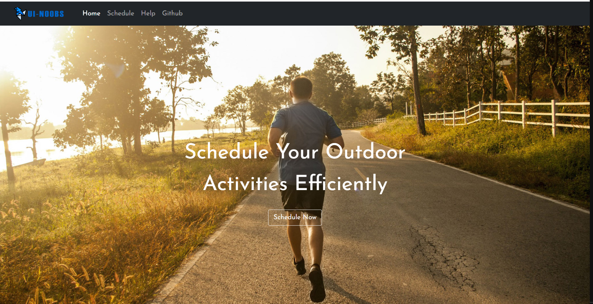

# ExerciseScheduler
This is an outdoor exercises planning tool (web page) based on user's schedule and weather forecast.  
## Preview
  

## About
EECS 493 User Interface Development (Fall 2021) Project  
Team: UI-Noobs
## API
- https://api.openweathermap.org
- TODO

## References
- https://www.bootdey.com/snippets/view/time-table#preview
- https://www.w3schools.com/howto/howto_js_slideshow.asp

## Source
- <a href="https://thefatkidinside.com/indoor-exercise-vs-outdoor-exercise/">outdoor.jpg</a>
- <a href="http://www.kcchampionperformance.com/news/2016/10/3/tips-for-outdoor-exercise-during-the-fall">img_1.jpg</a>
- <a href="https://www.nbcnews.com/better/health/what-you-need-know-taking-your-run-outdoors-ncna872491">img_2.jpg</a>

