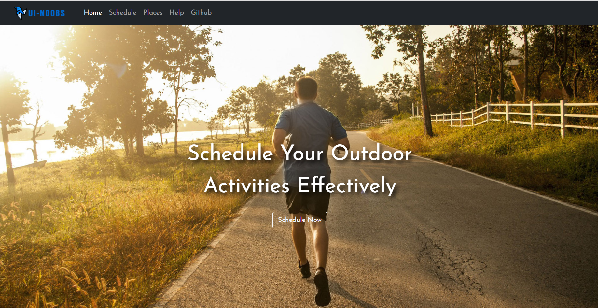
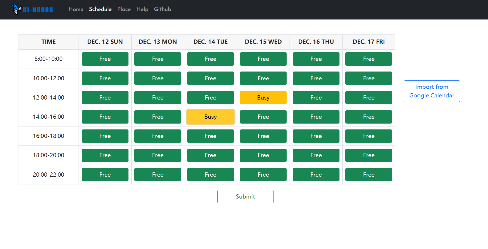
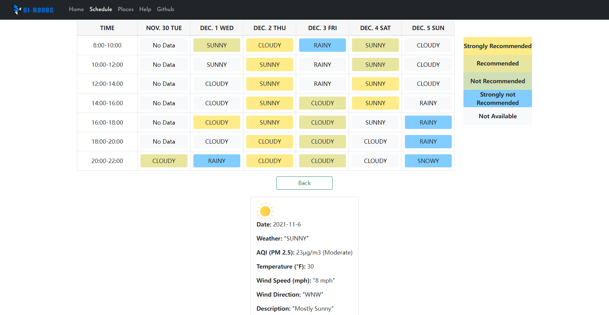
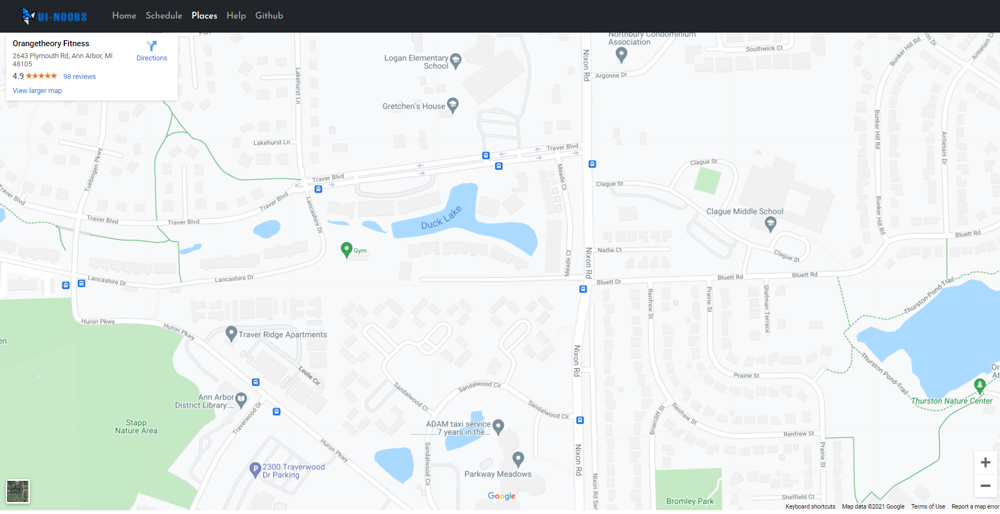

# ExerciseScheduler
This is an outdoor exercises planning tool (web page) based on user's schedule and weather forecast.  
## Preview
  
  
  
  

## About
EECS 493 User Interface Development (Fall 2021) Project  
Team: UI-Noobs
## API
- https://api.openweathermap.org
- https://api.weather.gov
- https://www.google.com/maps
- https://api.waqi.info/feed

## References
- https://www.bootdey.com/snippets/view/time-table#preview
- https://www.w3schools.com/howto/howto_js_slideshow.asp

## Source
- <a href="https://thefatkidinside.com/indoor-exercise-vs-outdoor-exercise/">outdoor.jpg</a>
- <a href="http://www.kcchampionperformance.com/news/2016/10/3/tips-for-outdoor-exercise-during-the-fall">img_1.jpg</a>
- <a href="https://www.nbcnews.com/better/health/what-you-need-know-taking-your-run-outdoors-ncna872491">img_2.jpg</a>
- <a href="https://www.google.com/search?hl=en&tbs=simg:CAQSgQIJClqTnan-dmoa9QELEKjU2AQaAghDDAsQsIynCBo5CjcIBBITrza1Brsw_1jyXGwDtDfoq2gPiJhoaqjAcUezedCAd_1n6B6i7CcvyFabetof67_11AgBTAEDAsQjq7-CBoKCggIARIE-CzQbgwLEJ3twQkaiwEKFwoDZnVu2qWI9gMMCgovbS8wZHM5OWxoChkKB2xlaXN1cmXapYj2AwoKCC9tLzA0ZzNyChoKB2pvZ2dpbmfapYj2AwsKCS9tLzAxc3l4ZwoeCgtmb3IgcnVubmluZ9qliPYDCwoJL2EvZzg3anB4ChkKBmFjdGl2ZdqliPYDCwoJL2EvN2NwaDN3DA&sxsrf=AOaemvLf7GjyoD2Rnc38jLR1pC32F7KzRA:1638319488432&q=encourage+physical+activity&tbm=isch&sa=X&ved=2ahUKEwiXvovZr8H0AhXHQs0KHeWSCacQwg4oAHoECAEQNQ&biw=1276&bih=654&dpr=1.44#imgrc=1hO8EyomPuV_wM">img_3.jpg</a>

